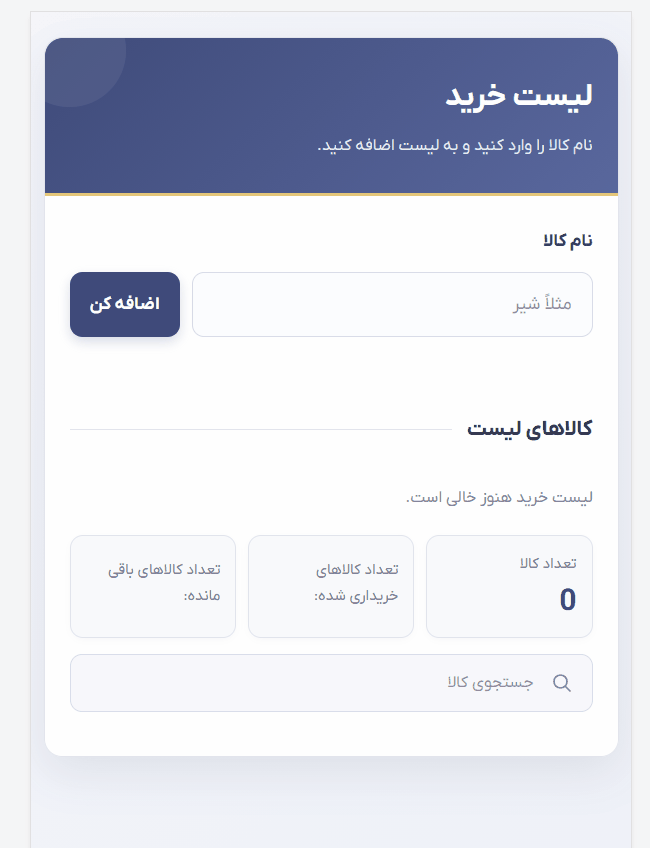

# 🛒 shopping-list-js

An interactive shopping list where users can add items, remove them, and track their purchase status. Built from scratch with **HTML, CSS, and Vanilla JavaScript**, with no frameworks or libraries.

## Description

`shopping-list-js` is a JavaScript and DOM practice project focused on turning real requirements into working application logic. Users can add items to a list, mark them as bought or not bought, delete them at any time, and see live counters for the total, purchased, and remaining items.

The project is fully responsive and works on both desktop and mobile screens.

## Features

**Adding items**
- Add new items to the end of the list
- Prevent empty or whitespace-only input
- Show an error message for invalid input
- Automatically clear the input after a successful add

**Removing items**
- A dedicated "Delete" button for every item
- Each item is removed independently without affecting the others
- Delete works on dynamically created items, and even after the purchase status has changed

**Purchase status**
- A "Bought" button for every item
- Clicking it strikes through the item's name and updates its status
- The button text toggles between "Bought" and "Not bought yet"
- Items can be switched back to their original state at any time

**Live counters**
- Total number of items
- Number of purchased items
- Number of remaining items
- All counters update instantly on add, delete, and status change

## Technologies

- HTML5
- CSS3 (Flexbox, CSS Grid, Media Queries, CSS Classes)
- Vanilla JavaScript (DOM Manipulation, Event Handling, Dynamic DOM Elements)

> No frameworks or libraries were used. No React, Bootstrap, Swiper, or anything else.

🔗 **Live Demo:** [View live project](https://anahita-valipour.github.io/shopping-list-js) <!-- update this link once GitHub Pages is enabled -->

---

## 📸 Preview

<!-- Replace with your actual screenshots or GIF -->

|               Mobile View                |                Desktop View                |
| :--------------------------------------: | :----------------------------------------: |
|  |  |

## How to Run

Clone the repository and open `index.html` in your browser. No installation required.

Or use the **Live Server** extension in VS Code to run it with a single click.

## Project Structure

```text
shopping-list-js/
├── index.html        # Page structure
├── style.css         # Styling and responsive layout
├── script.js         # App logic (DOM manipulation and events)
├── screenshots/
│   ├── mobile.gif    # Mobile preview
│   └── desktop.gif   # Desktop preview
└── README.md
```

## Learning Goals

This project was built to practice and strengthen:

- JavaScript fundamentals
- DOM manipulation
- Event handling
- Creating and removing elements dynamically
- Managing the state of UI elements
- Problem solving and translating requirements into program logic

---

## Author

**Anahita Valipour**
🔗 [GitHub](https://github.com/anahita-valipour)

---

## License

This project was built for educational and portfolio purposes only.
